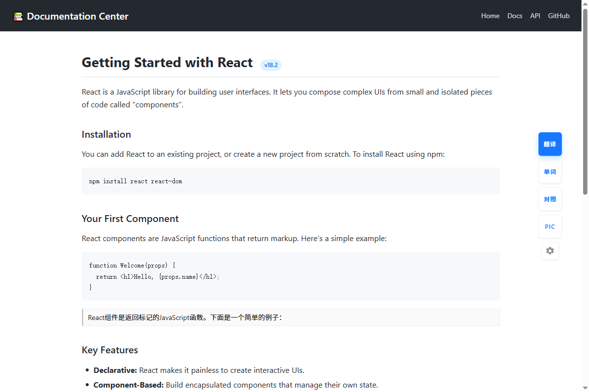
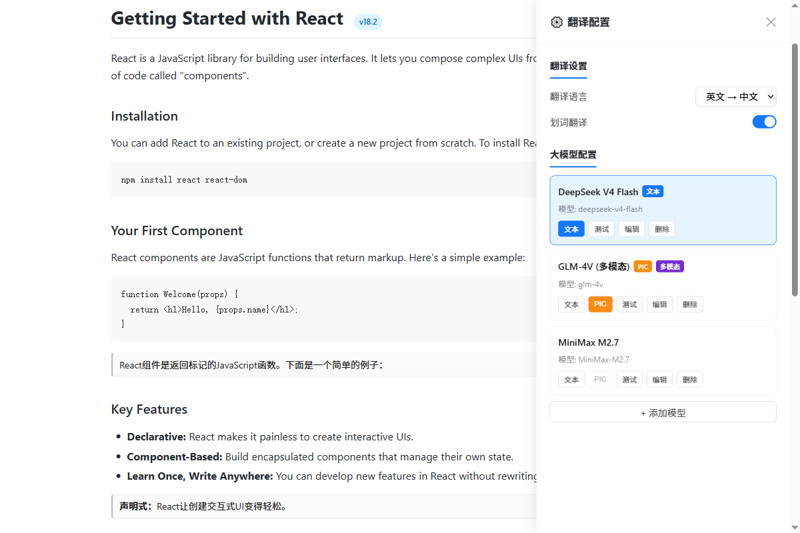
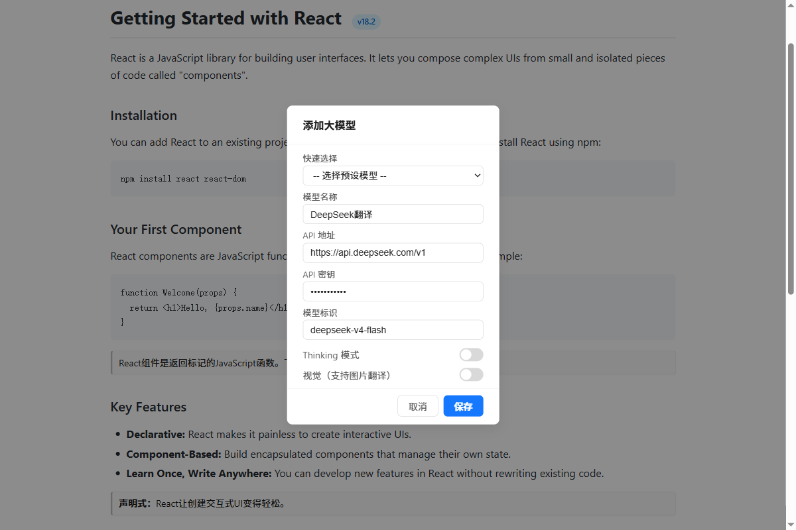
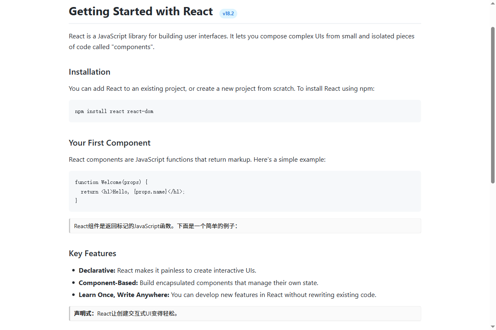
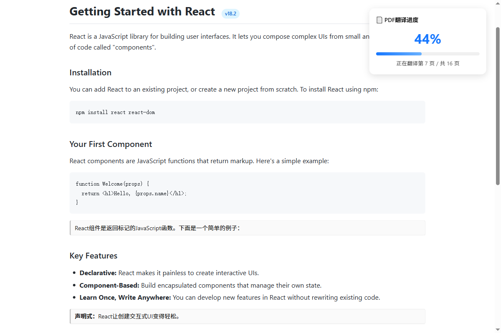

# larf's Translator — Chrome Web Translation Extension

[中文文档](./README.md) | **English**

> Translate English web pages to Chinese using LLMs (DeepSeek / Zhipu GLM / Volcengine / MiniMax / OpenAI, etc.). Supports side-by-side translation, selection translation, word lookup, and scanned PDF/image translation.

---

## Table of Contents

- [1. Quick Start (Installation)](#1-quick-start-installation)
- [2. Feature Preview](#2-feature-preview)
- [3. Button Overview](#3-button-overview)
- [4. Configuring LLMs (Step-by-Step Guide)](#4-configuring-llms-step-by-step-guide)
- [5. Core Features](#5-core-features)
- [6. Usage Scenarios](#6-usage-scenarios)
- [7. Project Architecture](#7-project-architecture)
- [8. Highlight Features](#8-highlight-features)
- [9. Notes & FAQ](#9-notes--faq)
- [10. Developer Guide](#10-developer-guide)

---

## 1. Quick Start (Installation)

### 1.1 What is a Chrome Extension?

A Chrome extension is a small program that runs inside Chrome-based browsers to add features. This extension adds a floating translation panel to the right side of any web page — just click to translate.

### 1.2 Installation Steps

**Prerequisite**: You need a Chromium-based browser (Chrome, Edge, Brave, 360 Speed Browser, etc.).

1. **Download the project files**

   Download the entire `translator-plugs` folder to any location, e.g., `D:\source\translator-plugs`.

2. **Open the extensions management page**

   - Chrome: Type `chrome://extensions/` in the address bar and press Enter
   - Edge: Type `edge://extensions/` in the address bar and press Enter

3. **Enable "Developer mode"**

   Find the "Developer mode" toggle in the top-right corner of the extensions page and turn it on.

4. **Load the unpacked extension**

   Click "Load unpacked" in the top-left corner and select the `translator-plugs` folder.

5. **Installation complete**

   You'll see "larf's Translator" in your extensions list. Open any web page and the floating translation panel will appear on the right side.

> **Tip**: After modifying code, click "Reload" on the extensions page, then refresh the web page for changes to take effect.

---

## 2. Feature Preview


*Floating panel on the right side, expands all buttons on hover*

---

## 3. Button Overview

Hover over the floating panel on the right side of the page to reveal the following buttons (top to bottom):

```
┌──────┐
│ 翻译 │  ← Blue button: Translate the entire page (English → Chinese)
├──────┤
│ 单词 │  ← Word/sentence translation: Manually input text to translate
├──────┤
│ 对照 │  ← Side-by-side: Insert translation below each original paragraph
├──────┤
│ PIC  │  ← Image/scanned PDF translation (requires multimodal LLM)
├──────┤
│ ⚙️  │  ← Settings: Manage LLM configurations
└──────┘
```

**Button States**:

| State | Meaning |
|-------|---------|
| Blue "翻译" (Translate) | Initial state, click to start translating |
| Green "原文" (Original) | Translation complete, click to restore original text |
| Gray "翻译中" (Translating) | Translation in progress, please wait |
| Green "对照中" (Side-by-side) | Side-by-side translation active or complete |
| Red "取消" (Cancel) | PIC translation in progress, click to cancel |

---

## 4. Configuring LLMs (Step-by-Step Guide)

> The extension itself doesn't include translation capability — you need to configure an LLM API. Think of the extension as a "remote control" and the LLM as the "engine" — you provide the engine.

### 4.1 How to Get an API Key

Using DeepSeek as an example (recommended for beginners — affordable and good quality):

1. Visit [DeepSeek Platform](https://platform.deepseek.com/)
2. Register an account and log in
3. Go to the "API Keys" page, click "Create API Key"
4. Copy the generated Key (e.g., `sk-xxxxxxxxxxxx`) — **it's only shown once, save it carefully**

Other providers work similarly:

| Provider | URL | Notes |
|----------|-----|-------|
| DeepSeek | https://platform.deepseek.com/ | Recommended, great value |
| Zhipu GLM | https://open.bigmodel.cn/ | Chinese, supports multimodal |
| Volcengine | https://www.volcengine.com/ | By ByteDance |
| MiniMax | https://platform.minimax.chat/ | Supports multimodal |
| OpenAI | https://platform.openai.com/ | Requires overseas network |

### 4.2 Configuring a Model in the Extension

1. **Open settings**: Click the ⚙️ gear icon on the floating panel


*Settings panel with translation options and LLM list management*

2. **Add a model**: Click the "+ Add Model" button


*Add LLM modal with preset selection and Thinking/Vision toggles*

3. **Fill in model information**:

   ```
   Quick Select: Choose a preset from the dropdown (recommended — auto-fills the fields below)
   
   Model Name: Display name, e.g., "DeepSeek Translator"
   API URL: https://api.deepseek.com/v1 (auto-filled by preset)
   API Key: sk-xxxxxxxxxxxxxxxxxx (paste your Key)
   Model ID: deepseek-v4-flash (auto-filled by preset)
   ```

4. **Toggle switches**:

   - **Thinking Mode**: When enabled, the LLM "thinks deeply" before translating — slightly better quality but slower. Usually keep it off.
   - **Vision (Image Translation)**: When enabled, this model can be used for PIC button image/PDF translation. Only multimodal-capable models support this (e.g., GLM-4V, GPT-4o).

5. **Save**: Click the "Save" button

6. **Set as default**: In the model list, click "Set as Default Text" to make it the default for the Translate button

7. **Test the model**: Click "Test" to verify the configuration. If a translation result is returned, the configuration is correct.

### 4.3 Dual Default Model Mechanism

The extension supports **two types of default models** — they can be the same model or different ones:

| Default Type | Used By | Badge |
|-------------|---------|-------|
| Default Text | "Translate", "Side-by-side", "Word", "Selection" | `文本` Blue |
| Default PIC | "PIC" button for image/PDF translation | `PIC` Orange |

**Why two types?** Multimodal models are typically much slower than text-only models. If you use a multimodal model for regular text translation, it will be very slow. By separating defaults, regular translation uses a fast text model while image translation uses a multimodal model — each optimized for its task.

> **Note**: Only models with the "Vision" toggle enabled can be set as PIC default.

---

## 4. Core Features

### 4.1 Page Translation ("Translate" Button)

**Purpose**: Replace all English content on the page with Chinese.

**Workflow**:
1. Click the "Translate" button
2. The extension collects all English text nodes on the page
3. Smart filtering: skips code blocks, JSON, pure numbers, UI button text (e.g., "OK", "Login")
4. Sends text to the LLM in batches (30 per batch, 3 concurrent)
5. Replaces original text with translations; button turns green showing "Original"
6. Click again to restore English

**Translation Direction**:
- English → Chinese (default)
- Chinese → English (switch in the extension popup)

### 4.2 Side-by-Side Translation ("Side-by-side" Button)

**Purpose**: Insert Chinese translation below each English paragraph without modifying the original — for easy comparison reading.


*Side-by-side mode: gray cards show translation below original text*

**Features**:
- Translation cards have a gray left border, displayed compactly below the original
- Doesn't break page DOM structure — translations are in a floating layer
- Automatically uses compact mode in tables/lists
- Supports cancellation (click the "Side-by-side" button again)

### 4.3 Word Translation ("Word" Button)

**Purpose**: Manually input words or sentences for translation, independent of page content.

**Usage**:
1. Click the "Word" button to open the input panel
2. Type the text you want to translate
3. Press Enter or click the translate button
4. Translation appears below

### 4.4 Selection Translation

**Purpose**: Select text on the page and a translation button pops up automatically.

**Usage**:
1. Select text on the page with your mouse
2. A small "Translate" button appears near the selection
3. Click it to translate the selected text

**Toggle**: Enable/disable in the extension popup (click the extension icon in the toolbar).

### 4.5 PIC Image/PDF Translation ("PIC" Button)

**Purpose**: Translate scanned PDFs or images on web pages. This is a highlight feature of the extension.

**Applicable Scenarios**:
- Online scanned PDFs (contracts, reports, scanned documents)
- Canvas-rendered PDF pages (react-pdf)
- Images on web pages (future expansion)

**How It Works**:
1. Detects Canvas elements on the page (PDF rendered pages)
2. Determines if it's scanned (checks if textLayer is empty)
3. Converts each Canvas page to a JPEG image
4. Sends to a multimodal LLM (e.g., GLM-4V, GPT-4o) for OCR + translation
5. Displays translation cards below each PDF page (with Markdown rendering)
6. Shows a prominent progress panel in the top-right corner (percentage + current page/total)


*PIC translation progress panel showing real-time percentage and current page*

**Prerequisites**:
- Must configure a model with the "Vision" toggle enabled
- Must set it as "PIC Default" (or any multimodal model will be used as fallback)

---

## 5. Usage Scenarios

### Scenario 1: Reading English Technical Documentation

1. Open an English documentation page (e.g., React official docs)
2. Click "Translate" → entire page becomes Chinese
3. When done, click "Original" → restore English

### Scenario 2: Side-by-Side Reading of Long Articles

1. Open an English article
2. Click "Side-by-side" → Chinese translation appears below each paragraph
3. Read with side-by-side comparison for better understanding
4. When done, click "Side-by-side" → remove translations

### Scenario 3: Translating Scanned PDF Contracts

1. Open an online PDF (e.g., a WorldFirst contract page)
2. Ensure a multimodal model (e.g., GLM-4V) is configured and set as PIC default
3. Click the "PIC" button
4. Progress panel appears in the top-right showing "Translating page N..."
5. When complete, translation cards appear below each PDF page
6. To cancel, click the red "Cancel" button

### Scenario 4: Quick Word Lookup

1. Double-click a word on the page (or drag-select)
2. A translate button pops up — click to translate
3. Or click the "Word" button to type manually

### Scenario 5: Chinese to English Translation

1. Click the extension icon in the browser toolbar
2. Select "中文 → 英文" in the "Translation Language" dropdown
3. Click "Confirm" to save
4. Open a Chinese web page, click "Translate" → becomes English

---

## 6. Project Architecture

### 6.1 File Structure

```
translator-plugs/
├── manifest.json      ← Extension config (MV3 format)
├── content.js         ← Content script (core logic, injected into web pages)
├── background.js      ← Background service worker (handles API requests)
├── popup.html         ← Extension popup page (toolbar icon click)
├── popup.js           ← Popup interaction logic
├── style.css          ← Styles injected into web pages
├── icon16.png         ← Toolbar icon (16x16)
├── icon48.png         ← Management page icon (48x48)
├── icon128.png        ← Store icon (128x128)
└── test/              ← Test files directory
```

### 6.2 Tech Stack

| Technology | Purpose |
|-----------|---------|
| Chrome Extension MV3 | Extension architecture standard |
| Vanilla JavaScript | No framework dependencies, pure JS |
| Chrome Storage API | Persist model configurations |
| Chrome Messaging API | content ↔ background communication |
| OpenAI-compatible API | LLM API interface (compatible with all OpenAI-format APIs) |

### 6.3 Architecture Diagram

```
┌─────────────────────────────────────────────────┐
│                   Web Page                       │
│                                                   │
│  ┌─────────────┐     ┌──────────────────────┐   │
│  │  content.js │     │     style.css         │   │
│  │             │     │  (injected styles)    │   │
│  │ · Float panel│    │  · Button styles      │   │
│  │ · Config UI  │    │  · Translation cards  │   │
│  │ · Translate  │    │  · Modal styles       │   │
│  │ · Text collect│   └──────────────────────┘   │
│  │ · DOM ops    │                                │
│  └──────┬──────┘                                │
│         │ chrome.runtime.sendMessage             │
└─────────┼────────────────────────────────────────┘
          │
          ▼
┌─────────────────────────────────────────────────┐
│              background.js (Service Worker)       │
│                                                   │
│  · Receives translation requests                  │
│  · Calls LLM API (fetch)                         │
│  · Timeout control (120s)                         │
│  · Returns translation results                   │
│  · Supports: translateText / translateMultimodal │
└─────────────────────────────────────────────────┘
          │
          ▼
┌─────────────────────────────────────────────────┐
│              popup.html / popup.js               │
│           (Extension popup - standalone page)     │
│                                                   │
│  · Translation direction (EN→ZH / ZH→EN)        │
│  · Timeout settings                               │
│  · Selection translation toggle                   │
│  · LLM config (add/edit/delete/test)             │
└─────────────────────────────────────────────────┘
```

### 6.4 Data Flow

**Page Translation Flow**:

```
User clicks "Translate"
    ↓
content.js collects web page text nodes
    ↓
Filter (skip code, Chinese, UI text, etc.)
    ↓
Batch (30 per batch, 3 concurrent)
    ↓
chrome.runtime.sendMessage → background.js
    ↓
background.js calls LLM API
    ↓
Returns translation → content.js
    ↓
Replace original / insert translation cards
```

**PIC Translation Flow**:

```
User clicks "PIC"
    ↓
content.js detects page Canvas (PDF pages)
    ↓
Check if scanned (textLayer is empty)
    ↓
Per page: Canvas → JPEG Base64
    ↓
chrome.runtime.sendMessage → background.js
    ↓
background.js calls multimodal API (Vision)
    ↓
Returns translation → content.js
    ↓
Insert translation card below Canvas (Markdown rendered)
    ↓
Update progress panel (percentage + current page)
```

---

## 7. Highlight Features

### 7.1 Smart Text Filtering

The extension doesn't blindly translate everything — it intelligently filters:

| Filter Type | Example | Reason |
|------------|---------|--------|
| Code blocks | `function foo() {}` | Code shouldn't be translated |
| JSON data | `{"name": "test"}` | Data structures shouldn't be translated |
| Pure numbers/dates | `2024-01-01` | No need to translate |
| Already Chinese | `你好世界` | Skip Chinese content |
| UI button text | `OK`, `Login`, `Submit` | Common UI text not translated |
| GitHub error templates | `Something went wrong` | Hidden templates, no translation needed |
| Version numbers | `v1.2.3` | No need to translate |

### 7.2 Markdown Translation Rendering

PIC translation cards support Markdown rendering — translations from the LLM are automatically formatted:

| Markdown Syntax | Rendered As |
|----------------|-------------|
| `# Heading` | Large heading |
| `**bold**` | **bold** |
| `*italic*` | *italic* |
| `- list item` | Bullet list |
| `1. ordered list` | Numbered list |
| `\| table \|` | Table |
| `` `code` `` | Code snippet |
| `> quote` | Blockquote |

### 7.3 Float Panel Auto-Recovery

Web pages may remove the extension's injected DOM elements due to React rendering, page scripts, etc. The extension has a built-in `watchPanelRemoval` mechanism:

- Checks every 2 seconds if the float panel still exists
- If removed, automatically recreates all UI elements
- Restores button states (translating, side-by-side, etc.)

### 7.4 Dual Default Models

As described above, supports "Default Text" and "Default PIC" settings:

- **Text translation**: Uses fast text models (e.g., DeepSeek Flash) for quick response
- **PIC translation**: Uses multimodal models (e.g., GLM-4V) for image recognition
- The two defaults are independent — can be the same model
- Click an already-default button to unset it (toggle logic)

### 7.5 Batch Concurrent Translation

To improve translation speed, the extension uses a batch concurrent strategy:

- **Batch size**: 30 texts per batch
- **Concurrency**: 3 simultaneous requests
- **Timeout protection**: 60 seconds per item (configurable 30-600 seconds)
- **Failure tolerance**: Individual failures don't affect other items

### 7.6 Cross-iframe Support

Some web pages use iframes for nested content (e.g., GitHub's file viewer). The extension runs in all iframes and coordinates translation across frames via `postMessage`.

---

## 8. Notes & FAQ

### 8.1 Important Notes

1. **API Costs**: LLM API calls incur charges from your API provider — this is unrelated to the extension. Monitor your API balance.

2. **Network Proxy**: If using overseas APIs (e.g., OpenAI), you need a VPN/proxy. The extension does not include any proxy functionality.

3. **API Key Security**: Your API Key is stored in Chrome's local storage and is never uploaded to any server. However, don't configure it on public computers.

4. **Translation Quality**: Quality depends on the LLM you choose. The extension only calls the API and displays results.

5. **Reloading**: After modifying code or updating config, click "Reload" on `chrome://extensions/`, then refresh the web page.

### 8.2 FAQ

**Q: Clicking "Translate" does nothing?**

A: Check the following:
1. Is an LLM configured? Click ⚙️ to check the model list
2. Is it set as "Default Text"?
3. Click "Test" to see if it returns normally
4. Check if the API Key is correct and the balance is sufficient

**Q: Translation is very slow?**

A: Possible causes:
1. Thinking mode is on → turn it off
2. Using a multimodal model for regular text → set a fast text model as "Default Text"
3. Too much page content → normal, just wait
4. API server is slow → try a faster model

**Q: PIC button says "Your model doesn't support multimodal"?**

A: PIC translation requires a multimodal model. In settings:
1. Add a multimodal-capable model (e.g., GLM-4V, GPT-4o)
2. Enable the "Vision" toggle
3. After testing, set it as "PIC Default"

**Q: PIC translation seems stuck?**

A: Multimodal models are slow with images (30-120 seconds per page). Check the progress panel in the top-right showing "Translating page N...". If truly stuck, click the red "Cancel" button.

**Q: Side-by-side translation positions are wrong?**

A: Translation cards use floating layer positioning. Rare page layouts may cause offset. This is a known limitation — try scrolling or re-translating.

**Q: Selection translation doesn't work?**

A: Check the "Selection Translation" toggle in the extension popup. Some pages may prevent text selection.

**Q: Page layout breaks after translation?**

A: Some page CSS may not accommodate Chinese text length differences. This is a page limitation — try "Side-by-side" mode instead of direct replacement.

**Q: How to switch translation direction (EN→ZH / ZH→EN)?**

A: Click the extension icon in the toolbar, switch in the "Translation Language" dropdown, click "Confirm" to save.

### 8.3 Known Limitations

1. **No local PDF support**: PIC translation only works with online PDF pages (Canvas-rendered)
2. **No video subtitle translation**: Current version doesn't process video subtitles
3. **Dynamic content needs re-translation**: After a page loads new content dynamically, click translate again
4. **Long text truncation**: Single texts over 50,000 characters are skipped

---

## 9. Developer Guide

### 9.1 Development Environment

- Any text editor (VS Code recommended)
- Chromium-based browser
- No Node.js or build tools needed (pure vanilla JS)

### 9.2 Code Structure Overview

#### content.js Key Functions

| Function | ~Line | Purpose |
|----------|-------|---------|
| `init()` | 52 | Initialize, create UI, load config |
| `handleTranslateClick()` | 2581 | "Translate" button handler |
| `handleCompareClick()` | 120 | "Side-by-side" button handler |
| `handlePicClick()` | 136 | "PIC" button handler |
| `startCompareTranslation()` | 205 | Side-by-side translation logic |
| `translateScannedPdf()` | 839 | Scanned PDF translation logic |
| `detectScannedPdf()` | 1276 | Detect scanned PDF |
| `shouldSkipTranslation()` | 341 | Smart text filtering |
| `renderMarkdown()` | 616 | Markdown rendering |
| `createFloatPanel()` | 1393 | Create floating panel |
| `createConfigPanel()` | 1543 | Create config panel |
| `renderModelList()` | 2108 | Render model list |
| `handleModelAction()` | 2164 | Model operations (default/edit/delete) |

#### background.js Key Functions

| Function | Purpose |
|----------|---------|
| `handleTranslateText(data)` | Text translation request |
| `handleTranslateMultimodal(data)` | Multimodal translation request |
| `buildTranslatePrompt(direction)` | Build translation prompt |
| `buildMultimodalPrompt(direction)` | Build OCR+translation prompt |
| `normalizeApiUrl(url)` | API URL normalization |
| `buildNoThinkingParams(model)` | Build no-thinking parameters |

### 9.3 Adding a New Preset Model

Add to the `MODEL_PRESETS` object in both `content.js` and `popup.js`:

```javascript
const MODEL_PRESETS = {
  // ... existing models
  'your-model-id': {
    name: 'Display Name',
    apiUrl: 'https://api.example.com/v1',
    model: 'model-id'
  }
};
```

Also add the corresponding `<option>` in `createAddModelModal()` (content.js) and the dropdown in `popup.html`.

### 9.4 Modifying Translation Behavior

Translation prompts are in `background.js`'s `buildTranslatePrompt()` function — adjust translation style, format, etc.

### 9.5 Debugging Tips

1. **content.js**: Press F12 on the web page, check Console for logs
2. **background.js**: Click "Service Worker" link on `chrome://extensions/`
3. **popup.js**: Right-click the extension popup → "Inspect"
4. **Storage data**: DevTools → Application → Storage → Local Storage

### 9.6 Code Conventions

- Use `var` for variable declarations (compatibility first)
- Add function-level comments explaining purpose
- Use `!important` in CSS to prevent page style pollution
- Centralized global state management (e.g., `isTranslating`, `isCompareMode`)

---

## Appendix: Preset Model List

| Preset | Model | API URL | Multimodal |
|--------|-------|---------|-----------|
| DeepSeek V4 Flash | deepseek-v4-flash | https://api.deepseek.com/v1 | No |
| DeepSeek V4 Pro | deepseek-v4-pro | https://api.deepseek.com/v1 | No |
| Zhipu GLM-5.1 | glm-5.1 | https://open.bigmodel.cn/api/paas/v4 | No |
| Volcengine ark-code | ark-code-latest | https://ark.cn-beijing.volces.com/api/coding/v3 | No |
| MiniMax M2.7 | MiniMax-M2.7 | https://api.minimax.chat/v1 | No |

> **Note**: Preset models may change as providers update. For multimodal models (PIC translation), add manually and enable the "Vision" toggle.

---

*This project is for learning and personal use. Translation quality depends on the selected LLM. Please use API quotas responsibly.*
